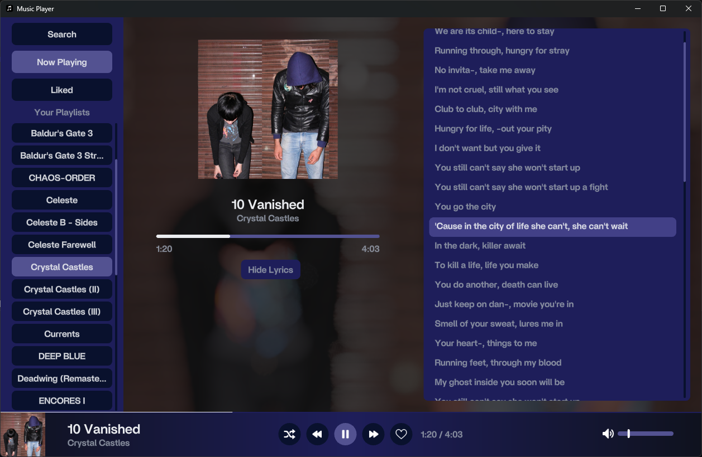
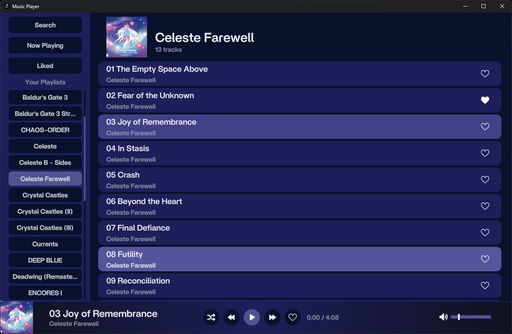

# mfbulut's Music Player

A minimalist, modern, and native music player

## Features

- **Auto-scans Music Folder**: By default, scans `C:\Users\{username}\Music\` for MP3 files.
- **Playlist Discovery**: Any folder containing MP3 files is treated as a playlist.
- **Cover Art Support**:
  - Attempts to load `cover.png` or `cover.qoi` if found in the folder.
  - Extracts embedded PNG cover art from MP3 metadata if available.

## Current State

This is **early-stage** code with low code quality it's a personal learning project. 
A full rewrite is planned for the future.

## Building

Run ``` odin build src -out:build\music.exe -o:speed -resource:src/assets/resource.rc -subsystem:windows ```
Currently only Windows supported


## Screenshots





