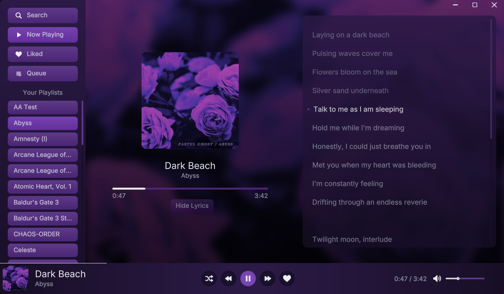
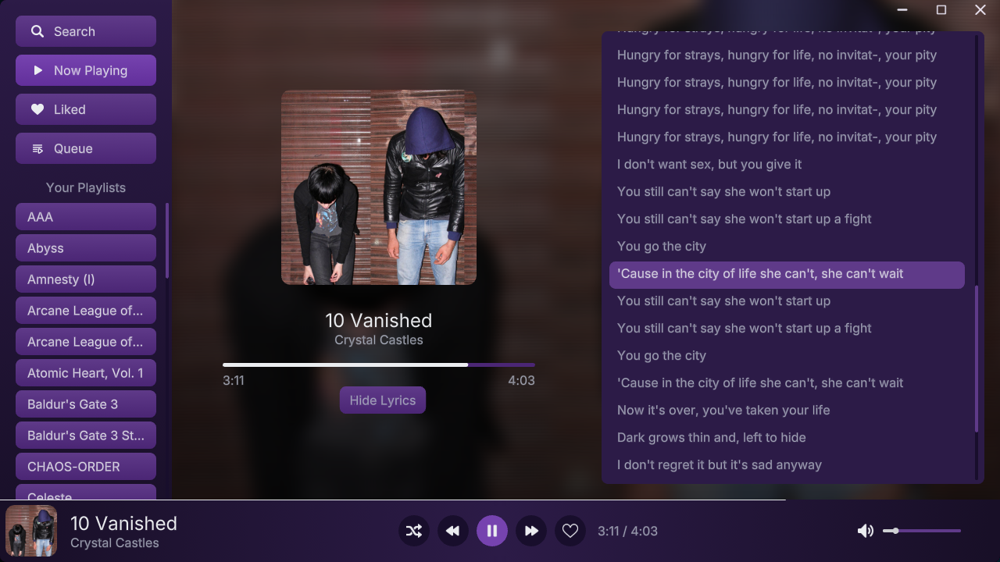
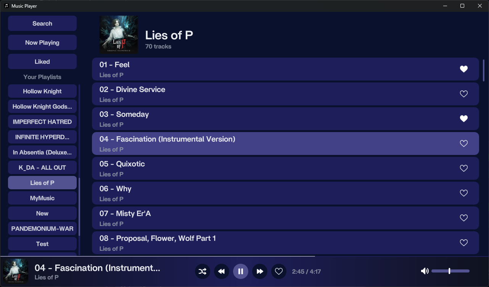
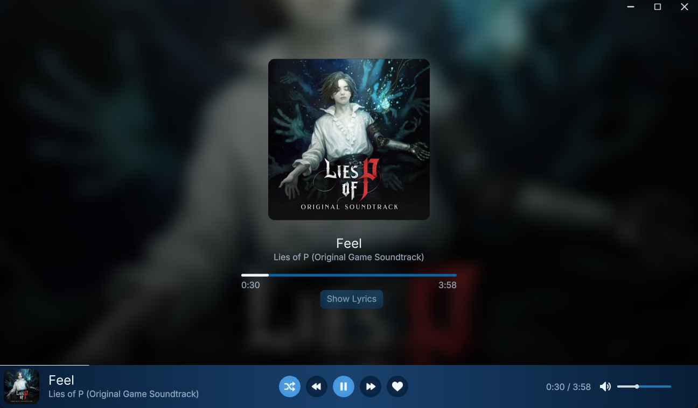

# mfbulut's Music Player

A **minimalist**, **modern**, and **native** music player

### [Download Here](https://github.com/mfbulut/MusicPlayer/releases/latest)

### Features
- **Auto-scans Music Folder**: By default, scans `C:\Users\{username}\Music\` for Music files.
  - Each folder treated as a playlist
- **Supported formats**: mp3, flac, wav and ogg
- **Cover Art Support**:
  - Extracts embedded cover art from file metadata.
  - If unavailable, tries to load cover.png, cover.jpg, or cover.qoi from the music folder.
- **Lyrics**: Supports synced lyrics via lrcget or local .lrc files

### Controls

| Action                | Shortcut             |
| --------------------- | -------------------- |
| Cycle Themes          | `F4`                 |
| Toggle Sidebar        | `Ctrl + B`           |
| Toggle Compact Mode   | `Ctrl + C`           |
| Add to End of Queue   | `Right-Click`        |
| Add to Start of Queue | `Ctrl + Right-Click` |
| Remove from Queue     | `Ctrl + Left-Click`  |

## Screenshots






## Building

Currently only Windows is supported

[Install Odin compiler](https://odin-lang.org/docs/install/) and run

```odin build src -out:music.exe -o:speed -resource:src/assets/resource.rc -subsystem:windows```

## Recommended Stuff

Metadata:
* https://picard.musicbrainz.org/

Lyrics:
* https://github.com/tranxuanthang/lrcget

Album covers
* https://covers.musichoarders.xyz/

Audio files:
* https://cobalt.tools/
* https://github.com/yt-dlp/yt-dlp
